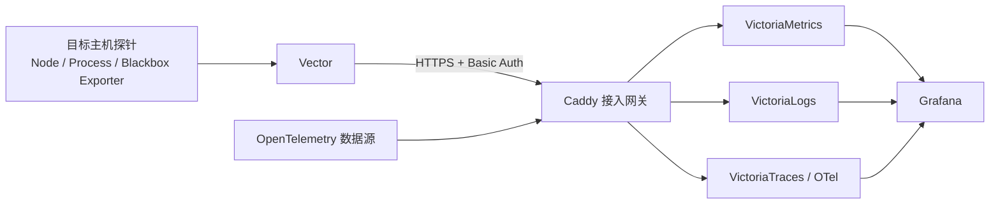

<h1 align="center">Observability</h1>
<p align="center"><strong>可观测性部署入口 | Telemetry Deployment Toolkit</strong></p>

<p align="center">
  <a href="https://github.com/ai-workspace-infra/observability"></a>
  <a href="LICENSE"></a>
  <a href="https://github.com/ai-workspace-infra/observability/actions/workflows/standalone-installers.yml"></a>
  <a href="https://github.com/ai-workspace-infra/observability/actions/workflows/validate-release-pr.yml"></a>
</p>

<p align="center"><strong>🇨🇳 简体中文</strong> ｜ <a href="docs/README.md">文档索引</a></p>

---

## 🇨🇳 项目概览

`ai-workspace-infra/observability` 提供可观测性中心服务与主机探针的一键部署入口。安装器复用 [平台 Playbooks](https://github.com/ai-workspace-infra/playbooks) 中的 Ansible roles 和服务模板，在目标主机部署采集、接入、存储与可视化组件。

本仓库维护轻量安装脚本、部署说明和契约检查；服务角色、多主机库存与编排以 `playbooks` 为准，避免两处实现漂移。

### 使命与交付准则

- **统一遥测**：汇集 Metrics、Logs 与 Traces，供 Grafana 查询与展示。
- **声明式部署**：安装器调用固定版本的 Playbooks，保留配置备份并执行部署后检查。
- **凭据最小暴露**：优先从 Vault 运行时读取监控账号；避免把秘密写进脚本、仓库或日志。
- **明确验收边界**：本机服务健康不等于中心端已收到数据；接入后还需检查指标和日志的新鲜度。

### 常用入口

- **Grafana**：[observability.svc.plus/grafana](https://observability.svc.plus/grafana/)
- **平台组织**：[ai-workspace-infra](https://github.com/ai-workspace-infra)
- **部署实现**：[playbooks](https://github.com/ai-workspace-infra/playbooks)
- **安装与验证说明**：[中文部署指南](docs/zh/deployment.md) · [架构与维护边界](docs/zh/architecture.md)

---

## 🏛️ 核心能力

<table>
<tr>
<td width="25%" align="center" valign="top">
  <h3>📥<br/>主机探针</h3>
  <p><strong>Metrics 与 Logs</strong></p>
  <p align="left"><sub>使用 Node Exporter、Process Exporter、Blackbox Exporter 与 Vector 采集主机指标和 systemd 日志；已有 Xray Exporter 可选接入。</sub></p>
</td>
<td width="25%" align="center" valign="top">
  <h3>🧭<br/>接入网关</h3>
  <p><strong>Caddy 与 TLS</strong></p>
  <p align="left"><sub>由 Caddy 统一提供 HTTPS 入口，并使用 HTTP Basic Auth 保护探针写入路径。</sub></p>
</td>
<td width="25%" align="center" valign="top">
  <h3>🗄️<br/>遥测存储</h3>
  <p><strong>指标、日志、链路</strong></p>
  <p align="left"><sub>VictoriaMetrics、VictoriaLogs、VictoriaTraces 与 OpenTelemetry Collector 提供后端存储和数据接入。</sub></p>
</td>
<td width="25%" align="center" valign="top">
  <h3>📊<br/>可视化与告警</h3>
  <p><strong>Grafana</strong></p>
  <p align="left"><sub>Grafana 汇总查询各遥测后端，提供仪表盘、探索与告警入口。</sub></p>
</td>
</tr>
</table>

---

## 🔄 部署与数据流



1. **准备认证**：Vault 提供 `kv/data/CICD/observability` 中的 `user`、`password`；两者用于 Caddy 写入入口的 HTTP Basic Auth。
2. **部署中心端**：在服务主机运行 Server 安装入口。若 Vault 相关变量全部缺失，安装器会生成一组随机写入凭据，并在部署及健康检查通过后于终端显示一次。
3. **部署探针**：在每台主机运行 Agent 入口。探针必须使用与中心端相同的 Vault 凭据，或安全输入服务端生成并显示的凭据。
4. **完成验收**：确认 Grafana、Caddy、存储服务健康，并在 Grafana 中按节点检查指标与日志是否持续更新。

---

## 🚀 部署 Observability

### 环境要求

- Debian 12+ 或 Ubuntu 24.04+
- 以 `root` 运行；Python 3.11+（安装器可在缺少 Python 时安装）
- 可访问 GitHub、系统软件源和监控服务端点

### Vault 环境

在目标主机当前 Shell 中设置 Vault 地址与监控秘密路径，由 Vault Agent 或受控运行环境提供 `VAULT_TOKEN`：

```bash
export VAULT_ADDR="https://<vault-host>"
export VAULT_OBSERVABILITY_SECRET_PATH="kv/data/CICD/observability"
# VAULT_TOKEN 由 Vault Agent 注入；不要用 env 或 set 回显秘密值
```

安装器从 KV v2 路径读取 `user`、`password`。`VAULT_TLS_SECRET_PATH` 用于代理 TLS 证书秘密，不替代监控账号路径。可通过以下方式检查变量是否注入，而不显示其内容：

```bash
for name in VAULT_ADDR VAULT_TOKEN; do
  if [[ -n "${!name:-}" ]]; then printf '%s: 已设置\n' "$name"; else printf '%s: 未设置\n' "$name"; fi
done
```

### 中心服务

服务端还需要 `GRAFANA_ADMIN_PASSWORD`。可由 Vault Agent 注入，或在当前 Shell 隐藏输入：

```bash
read -rsp "Grafana admin password: " GRAFANA_ADMIN_PASSWORD
printf '\n'
export GRAFANA_ADMIN_PASSWORD
curl -fsSL https://raw.githubusercontent.com/ai-workspace-infra/observability.svc.plus/main/setup-observability-server.sh | bash
unset GRAFANA_ADMIN_PASSWORD VAULT_TOKEN
```

## 🔌 接入 Observability Agent

```bash
curl -fsSL https://raw.githubusercontent.com/ai-workspace-infra/observability.svc.plus/main/setup-observability-agent.sh | bash
unset VAULT_TOKEN
```

若服务端使用自动生成的凭据，在每台探针上隐藏输入同一组值，再运行 Agent 安装入口：

```bash
read -rp "Caddy Basic Auth user: " VECTOR_AUTH_USER
read -rsp "Caddy Basic Auth password: " VECTOR_AUTH_PASSWORD
printf '\n'
export VECTOR_AUTH_USER VECTOR_AUTH_PASSWORD
curl -fsSL https://raw.githubusercontent.com/ai-workspace-infra/observability.svc.plus/main/setup-observability-agent.sh | bash
unset VECTOR_AUTH_USER VECTOR_AUTH_PASSWORD VAULT_TOKEN
```

安装器不会把自动生成的明文凭据写入中心端文件或 Ansible 日志。探针的 Vector 服务需要在本机受限权限配置中保留账号以持续上报。完整参数、备份与恢复说明见[部署指南](docs/zh/deployment.md)。

### 查看安装帮助

```bash
curl -fsSL https://raw.githubusercontent.com/ai-workspace-infra/observability.svc.plus/main/setup-observability-server.sh | bash -s -- --help
curl -fsSL https://raw.githubusercontent.com/ai-workspace-infra/observability.svc.plus/main/setup-observability-agent.sh | bash -s -- --help
```

---

## 🔐 认证说明

- Grafana 的 VictoriaMetrics 数据源通过 Docker 内网地址访问，当前配置为 `No Authentication`；Grafana 查询指标不需要单独的 Auth Token。
- Caddy 写入入口对探针使用 HTTP Basic Auth，默认从 Vault KV v2 `kv/data/CICD/observability` 读取 `user`、`password`。
- 未配置 `VAULT_ADDR`、`VAULT_TOKEN`、`VAULT_TLS_SECRET_PATH` 且未直接提供写入账号时，Server 安装器会生成随机账号，并仅在部署及健康检查成功后输出一次。若 Vault 变量只配置了一部分，安装器会失败关闭。
- Grafana Service Account Token 仅用于可选 Grafana MCP，Vault 字段为 `kv/data/observability/mcp` 中的 `GRAFANA_SERVICE_ACCOUNT_TOKEN`；独立安装入口默认关闭 MCP。

---

## 🧪 CI 与本地验证

Pull Request 会运行安装器契约检查、Shell 语法检查和凭据扫描。也可在本地执行：

```bash
bash -n setup-observability-server.sh setup-observability-agent.sh
python3 -m unittest discover -s tests -p test_standalone_installers.py -v
```

测试环境需要 PyYAML。静态检查通过不代表目标主机已经完成部署或中心端数据验收。

---

## 🧩 仓库职责

| 仓库 | 职责 |
| :--- | :--- |
| [`observability`](https://github.com/ai-workspace-infra/observability) | 独立安装入口、使用文档与安装器契约验证 |
| [`playbooks`](https://github.com/ai-workspace-infra/playbooks) | Ansible roles、服务模板、inventory 与多主机部署编排 |
| [`observability.svc.plus`](https://github.com/ai-workspace-infra/observability.svc.plus) | 监控站点与一键安装器发布入口 |

服务端与探针角色的变更应提交到 `playbooks`；本仓库承载安装体验与项目入口文档。XConnect 节点注册由 [xconnect-edge-agent](https://github.com/ai-workspace-xstream/xconnect-edge-agent) 管理，与通用主机探针安装分开。

---

<p align="center">
  <strong>安全 · 开放 · 可观测 · 可审计</strong><br/>
  <sub>Secure · Open · Observable · Auditable</sub>
</p>
